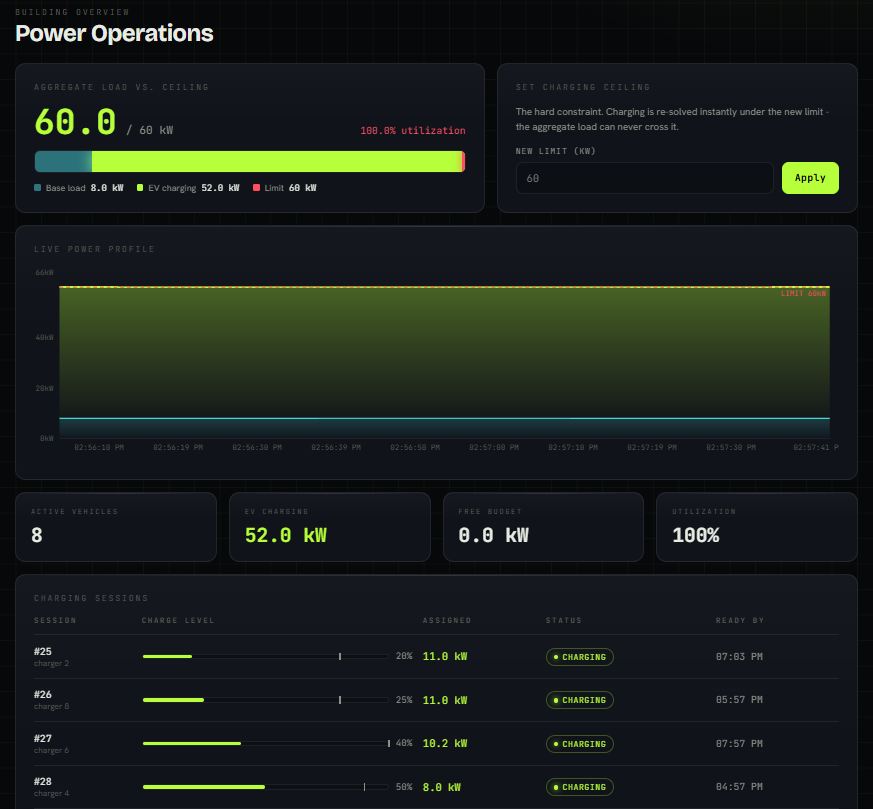

# Tomer Feldon

**AI agents, automation and end-to-end integrations**

[Projects](#at-a-glance) · [Where this applies to a CRM](#where-this-applies-to-a-crm) · [Contact](#contact)

<a href="https://charge-smart-psi.vercel.app">ChargeSmart</a> holding 8 vehicles under a 60 kW ceiling, live

I build systems that make decisions and move data between services without a human in the loop:
LLM-backed agents, automated pipelines, and API integrations. Software engineer, B.Sc. Computer
Science.

I work in both directions - orchestrating flows in **n8n** where that is the fastest path, and
dropping into code when a workflow hits the limits of what a visual builder can express.

## Stack

| | |
|---|---|
| **AI & agents** | Anthropic API · Claude Code · MCP (Model Context Protocol) · LiteLLM · self-hosted LLMs |
| **Automation & integration** | n8n · REST APIs · webhooks · Docker · Git |
| **Backend** | TypeScript · Node.js · Express · Python · FastAPI · Spring Boot (Kotlin) |
| **Frontend** | React |
| **Data** | MongoDB · PostgreSQL / Supabase · Kafka |

## At a glance

| Project | What it does | Stack | Links |
|---|---|---|---|
| **[ChargeSmart](#chargesmart---autonomous-scheduling-with-a-live-demo)** | Autonomous decision layer that reallocates EV charging power in real time under a hard power ceiling | Python · FastAPI · React · Supabase | [Live demo](https://charge-smart-psi.vercel.app) · [Code](https://github.com/tomerfeldon/ChargeSmart) |
| **[NAnalytics](#nanalytics---an-event-pipeline-that-doesnt-lose-events)** | Event pipeline that loses nothing: offline-tolerant SDK, multi-tenant backend, aggregation | Spring Boot (Kotlin) · vanilla JS · MongoDB | [Code](https://github.com/tomerfeldon/NAnalyticsSDK) |
| **[Air-gapped LLM stack](#self-hosted-llm-infrastructure-in-an-air-gapped-environment)** | Agentic AI tooling with zero data leaving the network | LiteLLM · Qwen · Claude Code · MCP | Architecture below |
| **[Other work](#other-work)** | Event ticketing system · marketplace data pipeline | - | Private |

---

## ChargeSmart - autonomous scheduling, with a live demo

**The problem.** When many tenants in a building charge electric vehicles at once, the combined
draw trips the main breaker. The usual fix is expensive proprietary hardware.

**What I built.** A software-only decision layer that continuously reallocates charging power
across every connected vehicle. It takes constraints in - building power limit, each car's target
charge, each driver's departure time - and outputs actions, with a hard guarantee that the
aggregate load never exceeds the limit while every car still finishes on time.

- Real-time reallocation as cars connect, disconnect and change state
- Multi-role access control: manager, resident, technician
- 74 passing tests covering the scheduling constraints

**Stack:** Python · FastAPI · React · TypeScript · PostgreSQL on Supabase

**Live demo:** https://charge-smart-psi.vercel.app
Sign in as `manager@chargesmart.test` / `manager123`

> [!NOTE]
> The demo runs on a free tier that sleeps when idle. The first request may take around 50 s
> to wake.

**Code:** https://github.com/tomerfeldon/ChargeSmart

---

## NAnalytics - an event pipeline that doesn't lose events

**The problem.** Getting events from a client into a backend reliably is harder than it looks:
networks drop, tabs close, endpoints fail. Events get silently lost.

**What I built.** A full analytics stack: client SDK, backend, and developer portal.

- The SDK persists events locally first, so it survives offline periods and page navigations
- Failed deliveries retry with exponential backoff and jitter, and resend automatically on
  reconnect
- The backend handles per-project authentication and isolation (multi-tenancy), payload
  validation, and aggregation pipelines for sessions, active users and top events
- Ships as a single deployable artifact

**Stack:** Spring Boot (Kotlin) · vanilla JS SDK, zero dependencies · MongoDB aggregation pipelines

**Code:** https://github.com/tomerfeldon/NAnalyticsSDK

---

## Self-hosted LLM infrastructure in an air-gapped environment

**The problem.** An enterprise environment with no internet access, where sending data to a cloud
model provider is not an option - but developers still need agentic AI tooling.

**What I built.** A complete local LLM stack: a self-hosted Qwen model served behind a LiteLLM
proxy, which exposes a single OpenAI-compatible API and routes requests across models.

- Claude Code runs against it as if it were talking to a cloud provider
- Agents, skills and MCP-based tool integrations all work with zero data leaving the network
- AI workflows can be built over sensitive data - patient records, private customer information -
  without that data ever leaving the organization's own infrastructure

**Stack:** LiteLLM · Qwen (self-hosted) · Claude Code · MCP · Docker

> [!NOTE]
> Architecture description only. The implementation itself is not public.

---

## Where this applies to a CRM

The projects above are all the same shape as CRM automation work: events come in, decisions get
made without a human, correct data comes out - and nothing breaks silently when a downstream
service does.

- **Lead capture and routing** - the NAnalytics delivery guarantees are exactly the problem of
  making sure no inbound lead is ever dropped between a form, an ad platform and the CRM.
- **Connecting the tools you already use** - n8n for the integration surface between CRM, calendar,
  messaging and ad platforms, with custom code nodes wherever the off-the-shelf integration stops
  being enough.
- **Follow-up and re-engagement agents** - LLM-backed agents that read customer context and act on
  it, built on the Anthropic API and MCP tooling I already work with daily.
- **Booking, reminders and no-shows** - ChargeSmart is a constraint-based scheduler: deadlines,
  capacity, competing demands, decisions recomputed continuously as reality changes.
- **Multi-branch reporting** - multi-tenant data isolation and aggregation pipelines, so each
  location gets its own view and management gets the roll-up.
- **Working over sensitive customer data** - the air-gapped stack above is the answer to "can we
  use AI on patient information without shipping it to a third party?"

---

## Other work

- **Event ticketing & entry management system** - end-to-end product: registration, ticket
  issuance, and entry validation.
- **Marketplace data pipeline** - automated collection and normalization of listing data from a
  source with no public API, surfaced in a dashboard.

> [!NOTE]
> Private repositories. Happy to walk through either one.

---

## Contact

**Email:** Tomerfeldon1@gmail.com
**GitHub:** https://github.com/tomerfeldon
